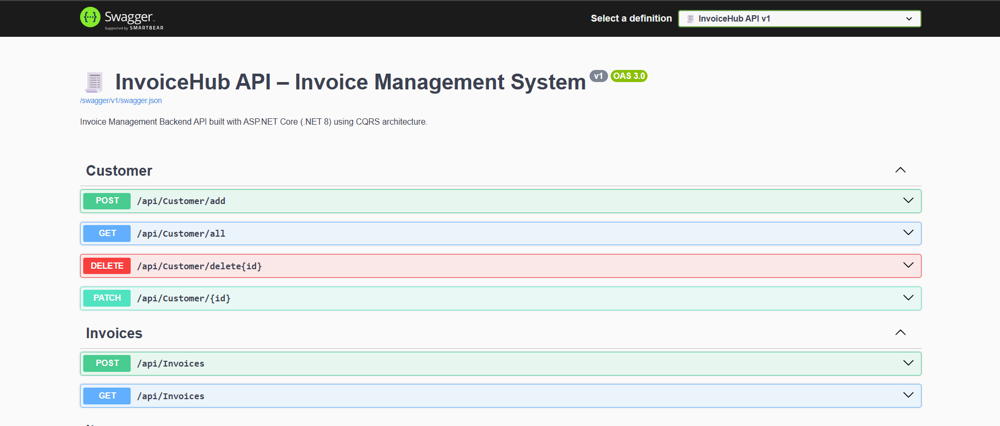
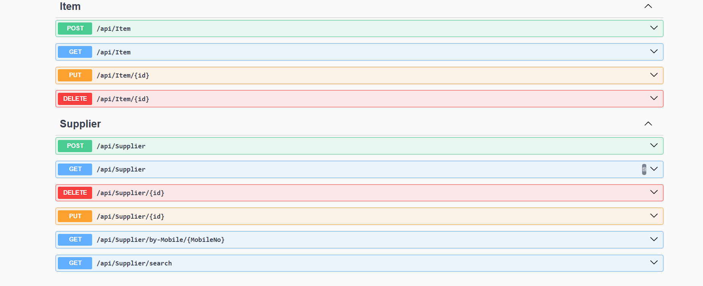

# 🧾 InvoiceHub API – Invoice Management System

A backend REST API built with **ASP.NET Core (.NET 8)** implementing the **CQRS pattern** for managing invoices, customers, suppliers, and items.

This project demonstrates a clean backend architecture using **CQRS, Repository Pattern, Entity Framework Core, and MediatR**.

---
## 🌐 Live API

🚀 **Live Swagger Documentation**

https://invoicehub-amy3.onrender.com/swagger/index.html


You can directly test the API endpoints from the deployed Swagger UI.
---
## 🚀 Tech Stack

* ASP.NET Core (.NET 8)
* C#
* Entity Framework Core
* SQL Server
* MediatR
* CQRS Pattern
* Swagger (OpenAPI)
* Docker
* Render Deployment

---
## ☁ Deployment

The API is deployed using cloud services and containerization:

- **Render** – Hosts the ASP.NET Core API
- **Railway** – Provides the MySQL database
- **Docker** – Used for containerizing the application
---

## 📌 Features

* Create and manage invoices
* Manage customers, suppliers, and items
* Command and Query separation using CQRS
* Generic repository pattern
* Clean layered architecture
* RESTful API endpoints
* Interactive API documentation with Swagger

---

## 📷 API Documentation (Swagger)

### 📊 Swagger API Overview



### 📦 Item & Supplier APIs



---

## 🏗 Project Architecture

The project follows a layered architecture with CQRS separation:

```
Controllers        → API Endpoints
CQRS               → Commands & Queries
Entities           → Domain Models
Repositories       → Data Access Layer
Data               → DbContext & Database Configuration
Common             → Shared utilities (Pagination etc.)
DTOs               → Data Transfer Objects
Mapping            → Entity ↔ DTO Mapping
```

---

## ▶ How to Run the Project

1️⃣ Clone the repository

```
git clone https://github.com/PratikByte/invoicehub.git
```

2️⃣ Navigate to the project folder

```
cd invoicehub
```

3️⃣ Update the connection string in:

```
appsettings.json
```

4️⃣ Run the database migrations

```
dotnet ef database update
```

5️⃣ Run the API

```
dotnet run
```

6️⃣ Open Swagger UI

```
http://localhost:5183/swagger/index.html
```

---

## 👨‍💻 Author

**Pratik Zodpe**

If you like the project, consider ⭐ starring the repository.
